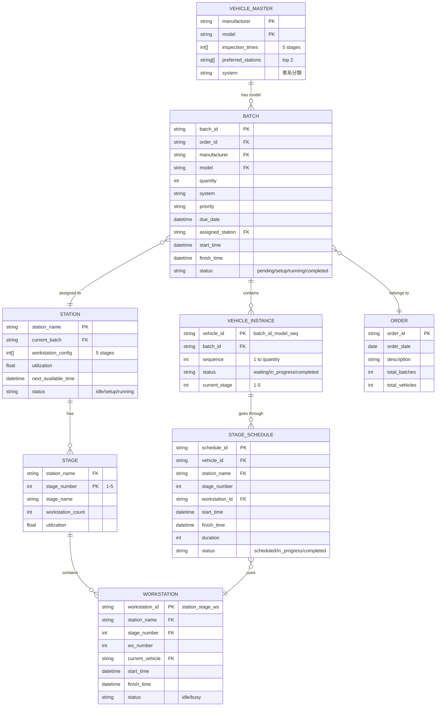
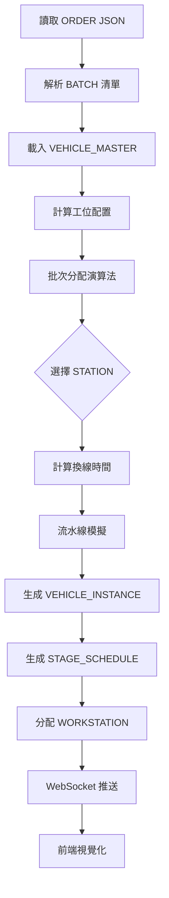
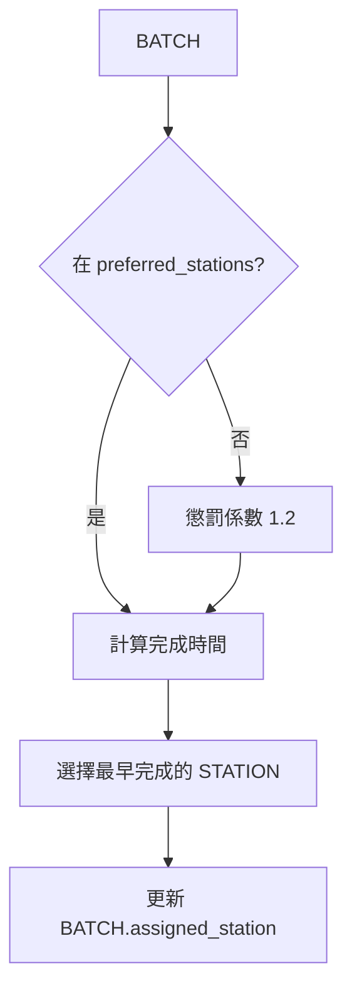
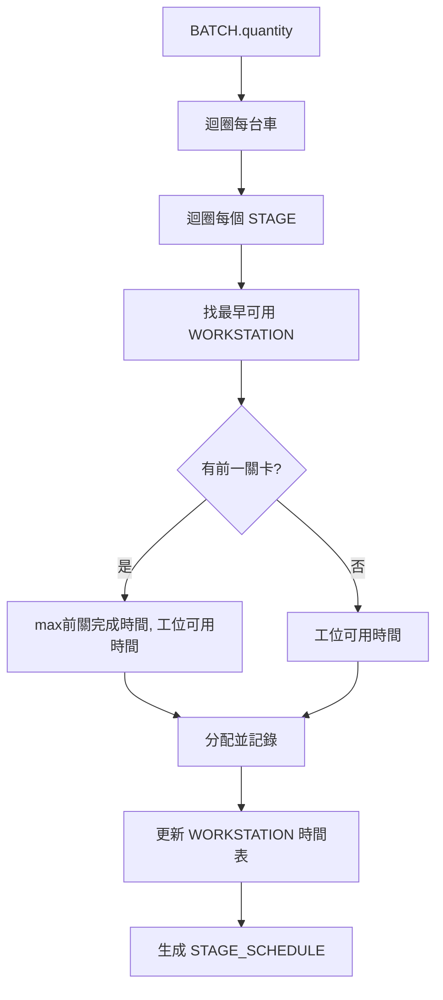
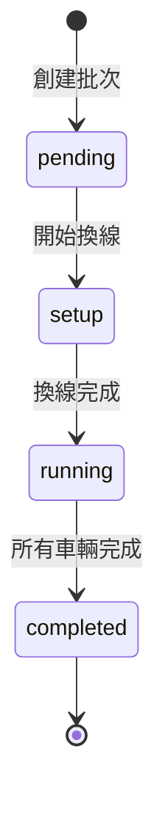
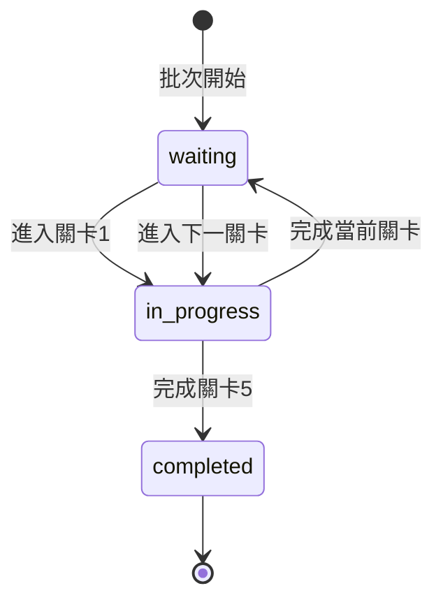
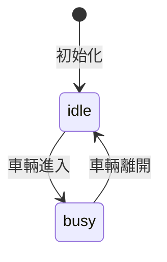

# 系統架構 ER 圖 (Entity Relationship Diagram)

## 實體關係圖



---

## 核心實體說明

### 1. VEHICLE_MASTER (車輛主數據)
**用途**: 儲存所有車型的基本資訊與檢修時間

**主鍵**: `(manufacturer, model)`

**關鍵欄位**:
- `inspection_times`: 5個關卡的標準檢修時間 [站1, 站2, 站3, 站4, 站5]
- `preferred_stations`: 偏好的兩個檢修廠
- `system`: 車系分類（日系/韓系/陸系/歐系/美系）

**資料來源**: `vehicles_data.json`

---

### 2. ORDER (工單)
**用途**: 代表一整批的檢修工單

**主鍵**: `order_id`

**關鍵欄位**:
- `order_date`: 工單日期
- `total_batches`: 總批次數
- `total_vehicles`: 總車輛數

**資料來源**: `test_orders_xxx.json`

---

### 3. BATCH (批次)
**用途**: 工單中的單一批次任務（同車商+車型+數量）

**主鍵**: `batch_id`

**關鍵欄位**:
- `quantity`: 該批次車輛數量
- `assigned_station`: 分配到的檢修廠
- `priority`: 優先級（high/normal/low）
- `due_date`: 交付期限
- `status`: 狀態
  - `pending`: 等待排程
  - `setup`: 換線中
  - `running`: 檢修中
  - `completed`: 已完成

**業務規則**:
- 換線時間 = (工位總數) × 2 分鐘
- 同一檢修廠處理相同車型可減少換線

---

### 4. VEHICLE_INSTANCE (車輛實例)
**用途**: 批次中的每一台具體車輛

**主鍵**: `vehicle_id` (格式: `{batch_id}_{model}_{seq}`)

**範例**: `1115_001_RAV4_3` (第001批次的第3台RAV4)

**關鍵欄位**:
- `sequence`: 在該批次中的序號（1 到 quantity）
- `current_stage`: 當前所在關卡（1-5）
- `status`: 
  - `waiting`: 等待進入下一關卡
  - `in_progress`: 檢修中
  - `completed`: 已完成所有關卡

---

### 5. STATION (檢修廠)
**用途**: 五個檢修廠的狀態管理

**主鍵**: `station_name`

**檢修廠清單**:
- 南高檢修廠
- 北高檢修廠
- 鳳山檢修廠
- 楠梓檢修廠
- 岡山檢修廠

**關鍵欄位**:
- `workstation_config`: 5個關卡的工位配置 [ws1, ws2, ws3, ws4, ws5]
- `current_batch`: 當前處理的批次
- `utilization`: 利用率（0.0 - 1.0）
- `next_available_time`: 最早可用時間

**工位計算邏輯**:
```python
ratios = [t / max(times) for t in inspection_times]
# 轉為最簡分數，通分後取分子
workstation_config = simplify_fractions(ratios)
```

---

### 6. STAGE (關卡)
**用途**: 檢修廠內的每個檢修關卡

**主鍵**: `(station_name, stage_number)`

**5個關卡**:
1. 車輛外觀檢查
2. 跑輸送帶電腦掃描
3. 起重機檢查底盤
4. 測試（動力、排氣、儀表板、煞車）
5. 集貨裝運

**關鍵欄位**:
- `workstation_count`: 該關卡的工位數量（動態計算）
- `utilization`: 該關卡的利用率

---

### 7. WORKSTATION (工位)
**用途**: 每個關卡內的具體工作位置

**主鍵**: `workstation_id` (格式: `{station}_{stage}_{ws}`)

**範例**: `南高_1_2` (南高檢修廠、站1、工位2)

**關鍵欄位**:
- `current_vehicle`: 當前處理的車輛ID
- `status`:
  - `idle`: 空閒
  - `busy`: 忙碌

**視覺化顯示**:
- 實線框: 使用中的工位
- 虛線框: 預留但未使用的工位（最多10個）

---

### 8. STAGE_SCHEDULE (關卡排程)
**用途**: 每台車在每個關卡的詳細時間表

**主鍵**: `schedule_id`

**關鍵欄位**:
- `vehicle_id`: 車輛實例ID
- `stage_number`: 關卡編號（1-5）
- `workstation_id`: 使用的工位
- `start_time`: 開始時間
- `finish_time`: 完成時間
- `duration`: 持續時間（分鐘）

**業務規則**:
- 必須依序完成 1→2→3→4→5
- 下一關卡開始時間 ≥ 前一關卡完成時間
- 工位必須可用（沒有其他車輛佔用）

---

## 資料流程圖



---

## 關鍵演算法關係

### 工位平衡計算


### 換線時間計算


### 批次分配


### 流水線模擬


---

## 狀態轉換圖

### BATCH 狀態轉換


### VEHICLE_INSTANCE 狀態轉換


### WORKSTATION 狀態轉換


---

## 索引建議

### 高頻查詢索引
```sql
-- 批次查詢
CREATE INDEX idx_batch_status ON BATCH(status);
CREATE INDEX idx_batch_station ON BATCH(assigned_station);

-- 車輛查詢
CREATE INDEX idx_vehicle_batch ON VEHICLE_INSTANCE(batch_id);
CREATE INDEX idx_vehicle_status ON VEHICLE_INSTANCE(status);

-- 排程查詢
CREATE INDEX idx_schedule_vehicle ON STAGE_SCHEDULE(vehicle_id);
CREATE INDEX idx_schedule_workstation ON STAGE_SCHEDULE(workstation_id);
CREATE INDEX idx_schedule_time ON STAGE_SCHEDULE(start_time, finish_time);

-- 工位查詢
CREATE INDEX idx_workstation_station ON WORKSTATION(station_name, stage_number);
CREATE INDEX idx_workstation_status ON WORKSTATION(status);
```

---

## 資料量估算

### MVP 測試規模
- **VEHICLE_MASTER**: 220 筆（固定）
- **ORDER**: 3 筆
- **BATCH**: 39 筆
- **VEHICLE_INSTANCE**: 470 筆
- **STATION**: 5 筆（固定）
- **STAGE**: 25 筆（5站 × 5關卡）
- **WORKSTATION**: ~85 筆（動態，平均每關卡 3.4 工位）
- **STAGE_SCHEDULE**: 2,350 筆（470車 × 5關卡）

### 生產環境估算（月）
- **ORDER**: ~60 筆
- **BATCH**: ~600 筆
- **VEHICLE_INSTANCE**: ~9,000 筆
- **STAGE_SCHEDULE**: ~45,000 筆

---

## 資料一致性規則

### 約束條件
1. **BATCH.quantity** = count(VEHICLE_INSTANCE where batch_id = BATCH.batch_id)
2. **STAGE_SCHEDULE** 每台車必須有 5 筆記錄（stage 1-5）
3. **WORKSTATION** 同一時間只能有一台車
4. **STAGE_SCHEDULE.start_time[n]** ≥ **STAGE_SCHEDULE.finish_time[n-1]** (同一車輛)
5. **STATION.workstation_config** 總和 = BATCH 換線時間 ÷ 2

### 業務規則
1. 車輛必須依序通過 5 個關卡
2. 同一工位不能同時處理兩台車
3. 批次分配後不可更改檢修廠（MVP階段）
4. OEE = 100%，無延遲或異常

---

## ER 圖圖例

```
||--o{ : 一對多
}o--|| : 多對一
||--|| : 一對一
}o--o{ : 多對多

PK : Primary Key
FK : Foreign Key
```
